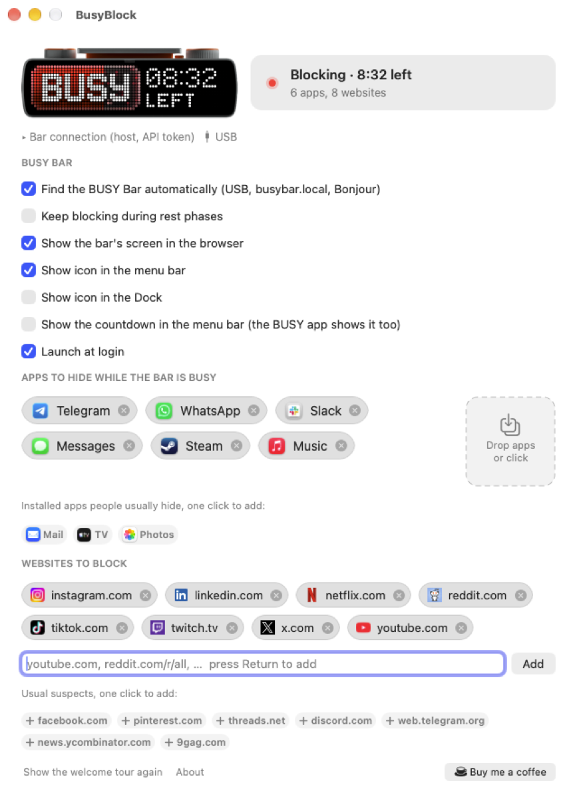
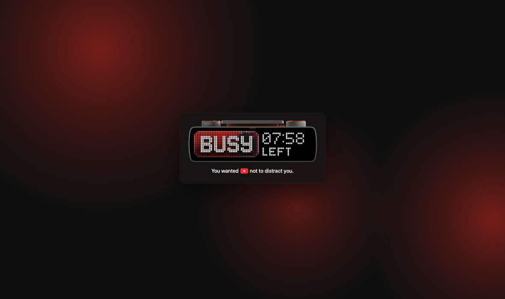

# BusyBlock

**The missing distraction blocker for Mac, to complement your BUSY Bar**

I was really missing a tool to help me to keep focus when I'm busy. The BUSY app 
for iOS does this natively, but many of us still work with a computer
and have many ways to get distracted. So this app had to appear. 

It hides distracting apps while you're busy. There are also browser
extensions that remind you that you're busy. Extensions sync seamlessly
with the app and your BUSY Bar.

## What it does

- **Hides apps.** Telegram, Slack (lol), Steam, whatever you consider distracting
- **Blocks websites.** A browser extension reminds you that you're busy and mirrors
your actual BUSY Bar display.

## Requirements

- macOS 13 or newer.
- A [BUSY Bar](https://busy.bar) on the same Wi-Fi or plugged in over USB.
- Safari, Firefox, or any Chrome-family browser (Chrome, Arc, Brave, Edge).

## Install

Download the latest DMG from [Releases](https://github.com/negenii/BusyBlock/releases/latest),
drag BusyBlock to Applications, and open it. 

## Set up

Opening the app for the first time walks you through it. Four steps, a couple of
minutes:

1. **Allow local network access.** macOS asks once. BusyBlock needs it to see the
   bar, over USB and over Wi-Fi alike.
2. **Find the bar.** It looks over the USB link first, then `busybar.local`, then
   Bonjour. 
3. **Turn on the browser extension.** Safari's is inside the app already, see
   below. Chrome-family browsers need the extension folder loaded once.
4. **Pick what distracts you.** Drop apps onto the window or take them from the
   suggestions, type websites or take them from the list.

## Browsers

**Safari.** The extension ships inside BusyBlock.app. Open Safari → Settings →
Extensions, tick BusyBlock, and allow it on every website. It needs access to
every site because it cannot know in advance which one you are about to open,
and it never sends a single one anywhere.

**Firefox.** Official extension is coming soon.

**Chrome, Arc, Brave, Edge.** Official extension is coming soon.
Until that: open `chrome://extensions`, turn on Developer mode, choose Load unpacked,
and pick the `extension` folder from this repository. The toolbar badge shows ON while a
session is blocking.

## Privacy

No data collected or shared (except favicons download and update checks).

Full policy: [PRIVACY.md](PRIVACY.md).

## Troubleshooting

**The bar is not found.** Plug it in over USB, or check both devices are on the
same network. The Bar connection section in Settings shows what it tried. A bar
with access protection on needs its API token pasted there.

**Websites are not blocked.** Check the extension is enabled and allowed on every
website, and that BusyBlock itself is running: the extension shows a `!` badge
when it cannot reach the helper. A session that started before the helper died
keeps blocking until it would have ended anyway.

**Safari forgot the extension after an update.** Safari disables extensions when
their app changes. Settings → Extensions, tick it again.

Still stuck? [Open an issue](https://github.com/negenii/BusyBlock/issues) and
include your macOS version, your browser, and what the Bar connection section
says. The log lives at
`~/Library/Application Support/BusyBlock/busyblock.log`.

## Contributing

Bug reports, ideas and pull requests are all welcome. See
[CONTRIBUTING.md](CONTRIBUTING.md) for how to build it, how it works inside, and
how to run the checks.

## Support the project

BusyBlock is free. If you find it useful,
[buy me a coffee](https://buymeacoffee.com/low.effort) is quite welcome.

## Credits

`extension/brand/busybar-device.png` is the BUSY Bar device render from the
[open-source firmware](https://github.com/busy-app/busybar-firmware), copyright
© Flipper Devices, used under CC-BY 4.0. BusyBlock is an unofficial project, not
affiliated with or endorsed by Flipper Devices. "BUSY Bar" is their trademark.

## License

GPL-3.0, see [LICENSE](LICENSE). Copyright and licensing details are in
[LICENSING.md](LICENSING.md).
